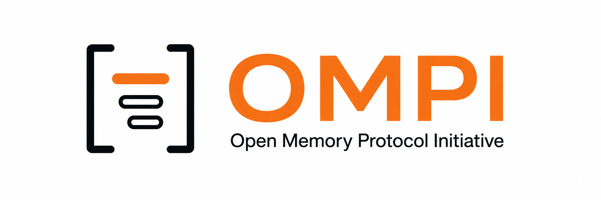

  

  <a href="https://ai-disclosures.org/omp"><strong>Site</strong></a> ·
  <a href="spec/draft-v0.1.md"><strong>Draft spec</strong></a> ·
  <a href="reference/"><strong>Reference implementation</strong></a> ·
  <a href="prototypes/"><strong>Prototypes</strong></a> ·
  <a href="GOVERNANCE.md"><strong>Governance</strong></a> ·
  <a href="docs/contributing.md"><strong>Contribute</strong></a>

  
  
  
  

---

# Open Memory Protocol Initiative

This repository is the shared working space for the Open Memory Protocol Initiative (OMPI), undertaken with partners to advance portable, interoperable, and user-controlled memory across AI systems.

The **Open Memory Protocol (OMP)** is the technical work: an open, interoperable protocol for portable AI-agent memory. **OMPI** is the multi-stakeholder working group that develops it, hosted at the [AI Disclosures Project](https://ai-disclosures.org/) (a project of [Code for Science & Society](https://www.codeforsociety.org/)).

## Why OMP

Agent memory is persistent context that affects future model or agent behavior: user-provided facts, model- or agent-derived summaries, project instructions, prior decisions and actions, tool outputs, and references to underlying transcripts or artifacts. It is scoped to a user, project, organization, or shared group, and is distinct from a raw chat export. A memory system selects, transforms, organizes, retrieves, and expires information for future use.

Every major coding-agent harness (Claude Code, Codex, goose, OpenClaw, Letta Code) implements memory, but each uses a different convention — `AGENTS.md`, `MEMORY.md`, `USER.md`, `HUMAN.md`. Developers cannot move a stateful agent from one harness to another. Enterprises cannot switch memory providers without re-ingesting derived memory objects. Open-source memory projects duplicate one another because there is no shared object model, provenance format, or exchange protocol to converge on.

Fragmented memory has real engineering and security costs. Developers write bespoke adapters. Users and enterprises cannot reliably move accumulated context. Provenance is often lost when memory is copied. Permissions that were meaningful in one system may not survive export, and security review is harder when each integration defines its own exchange behavior. OMP specifies the smallest interoperable layer needed to address these costs while allowing implementations to keep their own storage backends, ownership models, and internal architectures.

## What a portable OMP record contains

The working object model is developed openly and tested against real implementations. Expected minimum fields (design hypotheses, not fixed requirements at project start):

| Element | Purpose |
|---|---|
| **Identity and version** | Stable record identifier and schema/protocol version, for migration and de-duplication. |
| **Scope / namespace** | User, project, organization, or shared-group scope; separates memory that may be portable from memory that must remain local. |
| **Type and payload** | Small typed envelope plus implementation-extensible content, so systems can interoperate without forcing one internal memory taxonomy. |
| **Source and provenance** | Originating system, underlying event/transcript/artifact reference, transformation history, authorship/derivation metadata. |
| **Lifecycle** | Creation and update times, retention/expiry, optional decay/recency semantics. |
| **Permissions and consent** | Who or what may read, export, modify, or share a record; preserves access constraints during exchange. |
| **Integrity metadata** | Hashes, signatures, or other integrity information supporting chain of custody and tamper detection. |

See [ai-disclosures.org/omp](https://ai-disclosures.org/omp) for the full security-and-risk table and the four-rule harness contract.

## Repository layout

- [`spec/draft-v0.1.md`](spec/draft-v0.1.md) — the current draft specification, authored by Charles Packer (Letta) with feedback from the AI Disclosures Project team.
- [`reference/`](reference/) — Python reference implementation of the loader, validator, and harness contract (runs against any spec-conformant memory directory).
- [`prototypes/acp_memory_server/`](prototypes/acp_memory_server/) — ACP-based MCP memory-server prototype (Sruly Rosenblat).
- [`references/`](references/) — research, source notes, and background reading relevant to the initiative.
- [`docs/contributing.md`](docs/contributing.md) — how to participate in the working group.
- [`GOVERNANCE.md`](GOVERNANCE.md) — steering committee, RFC process, licensing, long-term stewardship.
- [`media/`](media/) — logo and other visual assets.

## First vertical: coding agents

OMP's initial development focus is the coding-agent vertical, where memory lock-in is most acute and developer users adopt standardized tooling fastest. The reference implementation targets memory transfer across Claude Code, Codex, goose, and Letta Code as a first end-to-end benchmark.

Once the protocol has stable production adoption, the written specification will be submitted to the IETF for formal ratification.

## Working group

Formal in-kind partners: **Mozilla** and **IBM**. Direct implementation and specification collaborators: **Letta** (specification lead), **Block / goose** (open-source agent harness). Broader working group spans agent framework maintainers, memory-focused open-source projects, vector-database providers, and enterprise adopters.

- Kickoff technical convening: **September 9, 2026** (online, co-hosted with Mozilla and IBM).
- Optional gathering: **October 2026** at the O'Reilly open-source unconference (Berkeley).

## Working principles

The initiative is focused on an open memory ecosystem in which people can retain meaningful control over their data, move context between compatible AI tools, and benefit from competition and innovation without rebuilding their history in every application.

This repository will evolve as the initiative and partner work progress.

## How to contribute

- Read the [current draft spec](spec/draft-v0.1.md) and open an issue with feedback.
- Try the Python reference implementation ([`reference/`](reference/)) against your own memory workload.
- Explore the ACP-based memory-server prototype ([`prototypes/acp_memory_server/`](prototypes/acp_memory_server/)).
- Contact [ompi@aidisclosures.org](mailto:ompi@aidisclosures.org) to join the working group.

## License

- Specification and documentation: [CC BY 4.0](https://creativecommons.org/licenses/by/4.0/)
- Reference implementation and other code in this repository: [Apache 2.0](LICENSE)
