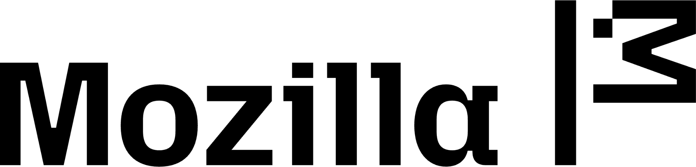
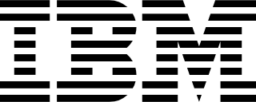

<p align="center">
  
</p>

<p align="center">
  <a href="https://ai-disclosures.org/ompi"><strong>Site</strong></a> ·
  <a href="early-draft-specs/"><strong>Draft technology</strong></a> ·
  <a href="prototypes/python-loader-validator/"><strong>Python code</strong></a> ·
  <a href="prototypes/"><strong>Prototypes</strong></a> ·
  <a href="GOVERNANCE.md"><strong>Governance</strong></a> ·
  <a href="docs/contributing.md"><strong>Contribute</strong></a> ·
  <a href="https://discord.gg/7DbzzxZ9y"><strong>Discord</strong></a>
</p>

<p align="center">
  
  
  
  
  <a href="https://discord.gg/7DbzzxZ9y"></a>
</p>

<p align="center">
  <sub><b>Hosted at</b></sub><br>
  <a href="https://ai-disclosures.org/"></a>
</p>

<p align="center">
  <sub><b>Co-hosted with</b></sub><br>
  <a href="https://www.mozilla.org/"></a>
  &nbsp;&nbsp;&nbsp;&nbsp;&nbsp;&nbsp;&nbsp;&nbsp;
  <a href="https://www.ibm.com/"></a>
</p>

---

> **Current stage.** OMPI is an open-source ecosystem in early public development. The v0.1 draft technology and experimental Python implementation are open for community iteration, and the ecosystem's first public convening is **September 9, 2026** (online, co-hosted with Mozilla and IBM). All artifacts in this repository are developed openly for use, adoption, and iteration by contributors and implementers across the ecosystem.

<p align="center">
  <a href="https://discord.gg/7DbzzxZ9y">
    
  </a>
  <br>
  <sub>Working-group discussion, implementer Q&amp;A, and convening coordination. Membership is by application; tell us who you are and what you are building.</sub>
</p>

---

# Open Memory Protocol Initiative

The **Open Memory Protocol (OMP)** is an open, royalty-free technology for portable, interoperable memory across AI agents and services. The **Open Memory Protocol Initiative (OMPI)** is the multi-stakeholder, vendor-neutral open-source ecosystem that develops, maintains, and grows OMP. OMPI is hosted at the [AI Disclosures Project](https://ai-disclosures.org/), a project of [Code for Science & Society](https://www.codeforsociety.org/).

This repository is the technical and governance home of the ecosystem.

## Key Artifacts

### Specs

- **Letta Draft Spec v0.2** — Updated draft by Charles Packer (Letta). Expanded schema, provenance, and lifecycle definitions. [`early-draft-specs/draft-v0.2-packer.pdf`](early-draft-specs/draft-v0.2-packer.pdf)

- **IBM Draft Spec v0.1** — IBM's initial draft OMP specification. [`early-draft-specs/draft-v0.1-ibm.pdf`](early-draft-specs/draft-v0.1-ibm.pdf)

- **AI Disclosures Project Draft Spec v0.1** — Draft OMP specification from the AI Disclosures Project, authored by Sruly Rosenblat. [`early-draft-specs/draft-v0.1-aidp.pdf`](early-draft-specs/draft-v0.1-aidp.pdf)

- **Cognee / COGX Proposal v0.1** — A semantic core for portable agent memory: identity, evidence, authority, lineage, lifecycle, and exchange fidelity. Uses COGX as an implemented reference input, distinguishes current capabilities from proposed guarantees, and positions Markdown as a profile and runtime APIs and federation as bindings. [PDF](early-draft-specs/draft-v0.1-cognee.pdf) · [Markdown source](early-draft-specs/draft-v0.1-cognee.md)

- **Agent Memory System Card (AMS Card)** — A structured documentation format for agent memory systems, by [Mila](https://mila.quebec/) and [Mozilla](https://mozilla.org). Model cards made language models legible; dataset cards did the same for training data — memory systems had no equivalent until now. Template, reference card, and evaluation framework: [`mila-iqia/agent-memory-system-card`](https://github.com/mila-iqia/agent-memory-system-card/) (goes live Sep 9). Draft, open for comment. [`early-draft-specs/ams-card.md`](early-draft-specs/ams-card.md)

- **`me.md`** — Draft personal-sovereignty memory protocol authored by David Hamilton (Block / goose). A user-owned, plain-file protocol for what agents know about you: files live on the user's machine, agents may only *propose* additions, and the user decides what becomes memory. Complementary discussion draft in the OMP ecosystem. Canonical source: [`github.com/block/me.md`](https://github.com/block/me.md)

### Other

- **Memory Ecosystem Scoping Note** — Surveys current memory implementations and shared primitives an open technology can standardize (August 2026). [`early-draft-specs/scoping-note-2026-09.pdf`](early-draft-specs/scoping-note-2026-09.pdf)

- **Python Implementation** — Draft loader, validator, and harness contract for the draft open memory protocol technology. [`prototypes/python-loader-validator/`](prototypes/python-loader-validator/)

- **Packer Draft LangChain Harness** — A `create_agent` middleware implementing the four-rule harness contract from the Packer draft spec v0.2, with an offline test suite and CLI. [`prototypes/packer-draft-langchain-harness/`](prototypes/packer-draft-langchain-harness/)

- **AIDP Draft FMP Reference Implementation** — Federated Memory Protocol server (`/fmp/*` endpoints), federated client, and LangChain middleware, including a read-only FMP view over the ACP memory-server index. [`prototypes/aidp-draft-fmp/`](prototypes/aidp-draft-fmp/)

- **IBM Draft Memory Records** — Immutable memory records with lifecycle and provenance, override/invalidate time travel, scope-tag ACLs, export/import with tag mapping, a Packer-directory round-trip bridge, and the Remember/Recall/Observe/Decorate verbs as LangChain middleware. [`prototypes/ibm-draft-memory-records/`](prototypes/ibm-draft-memory-records/)

- **Context Nest Draft Adapter** — LangChain middleware that plugs an agent into a Context Nest, local or hosted, through `ctx`, the draft's reference implementation: pack preloading, selector queries, published-only serving, and propose-for-review writes. [`prototypes/contextnest-draft-adapter/`](prototypes/contextnest-draft-adapter/)


- **ACP-Based MCP Memory-Server Prototype** — An old experimental prototype indexing sessions across twelve coding-agent harnesses (Claude Code, Codex, Goose, Cursor, Cline, Roo, Kilo, Zed, Gemini CLI, Qwen Code, Continue, Aider). Originated in [`SrulyRosenblat/agent_memory_mcp`](https://github.com/SrulyRosenblat/agent_memory_mcp) with first commits in *May 2026*; imported here at upstream commit `02b8d92`. [`prototypes/acp_memory_server/`](prototypes/acp_memory_server/)

## Why an Open Protocol

Agent memory is persistent context that affects future model or agent behavior: user-provided facts, model- or agent-derived summaries, project instructions, prior decisions and actions, tool outputs, and references to underlying transcripts or artifacts. It is scoped to a user, project, organization, or shared group, and is distinct from a raw chat export. A memory system selects, transforms, organizes, retrieves, and expires information for future use.

Every major coding-agent harness (Claude Code, Codex, goose, OpenClaw, Letta Code) implements memory, but each uses a different convention — `AGENTS.md`, `MEMORY.md`, `USER.md`, `HUMAN.md`. Developers cannot move a stateful agent from one harness to another. Enterprises cannot switch memory providers without re-ingesting derived memory objects. Open-source memory projects duplicate one another because there is no shared object model, provenance format, or exchange technology to converge on.

The fragmentation has real engineering and security costs. Developers write bespoke adapters. Users and enterprises cannot reliably move accumulated context. Provenance is often lost when memory is copied. Permissions that were meaningful in one system may not survive export, and security review is harder when each integration defines its own exchange behavior. OMP is the smallest interoperable technology layer that addresses these costs, while allowing implementers to keep their own storage backends, ownership models, and internal architectures.

## Shared practices in the ecosystem

The ecosystem's brief [scoping note](early-draft-specs/scoping-note-2026-09.pdf) surveys memory implementations across coding harnesses, consumer assistants, and enterprise agent systems and identifies shared practices that a minimal open technology can standardize. These are the concrete issues the working group will iterate on:

1. **Persistent memory across sessions.** Memory that survives across chat sessions rather than disappearing at conversation end. Present in Claude Code, OpenHands, Hermes, VS Code / Copilot, Deep Agents, ChatGPT, Gemini, AWS AgentCore, Vertex Memory Bank, and Microsoft Foundry.
2. **Scope and ownership.** Every memory tied to an owner or context — user, project, agent, team, or organization. Labels vary across systems, but each can answer "whose memory is this?"
3. **Lifecycle operations.** Memory treated as something with a lifecycle: create (remember), read (recall), update (correct or revise), delete (forget). Explicit in Hermes, Letta, Foundry, Copilot Studio, and various coding harnesses.
4. **Selective retrieval.** Agents request the memories relevant to the current task rather than loading the entire memory store.
5. **Controls and policy.** Rules for privacy, access, retention, provenance, and permission.

## Repository Layout

```
Open-Memory-Protocol/
├── early-draft-specs/           — specifications & scoping notes
│   ├── draft-v0.2-packer.pdf       (Packer draft technology spec, v0.2)
│   ├── draft-v0.1-ibm.pdf          (IBM draft technology spec, v0.1)
│   ├── draft-v0.1-aidp.pdf         (AI Disclosures Project draft, v0.1)
│   ├── draft-v0.1-cognee.pdf       (Cognee / COGX exchange proposal, v0.1)
│   ├── draft-v0.1-cognee.md        (editable source of the Cognee proposal)
│   ├── ams-card.md                 (Agent Memory System Card — Mila & Mozilla)
│   └── scoping-note-2026-09.pdf    (Strauss & Rosenblat scoping note, Sept 2026)
├── prototypes/                 — experimental code
│   ├── python-loader-validator/    (Python loader + validator sketch)
│   ├── packer-draft-langchain-harness/  (LangChain harness for the Packer draft v0.2 contract)
│   ├── aidp-draft-fmp/             (FMP server, federated client, middleware; AIDP draft v0.1)
│   ├── ibm-draft-memory-records/   (immutable records, ACLs, import/export, 4 verbs; IBM draft v0.1)
│   ├── contextnest-draft-adapter/  (agent plug for a local or hosted nest via ctx; Context Nest draft v0.1)
│   └── acp_memory_server/          (ACP-based MCP memory-server prototype)
├── research/                   — research notes, background reading, essays
├── docs/                       — contributing guide and other docs
├── media/                      — logo and visual assets
├── GOVERNANCE.md               — Technical Steering Group, decision process, licensing
└── README.md
```

Three top-level content folders (`early-draft-specs/`, `prototypes/`, `research/`) plus supporting files at the repo root.

## First vertical: coding agents

The ecosystem's initial implementation focus will be compatibility with coding-agents, where memory lock-in is most acute and developer adoption of standardized tooling is fastest. Early implementations explore memory transfer across Claude Code, Codex, goose, and Letta Code as a first implementation.

## Ecosystem partners

Formal in-kind partners: **Mozilla** and **IBM**, co-hosting convenings and leading recruitment across their developer and enterprise networks. Technology and implementation collaborators: **Letta** (draft technology author, reference implementer), **Block / goose** (open-source coding-agent harness, first-vertical implementer). The wider ecosystem spans agent-framework maintainers, memory-focused open-source projects, vector-database providers, and enterprise adopters.

- First ecosystem convening: **September 9, 2026** (online, co-hosted with Mozilla and IBM).
- In-person gathering: **October 2026** at the O'Reilly open-source unconference (Berkeley).

## Governance and sustainability

OMPI is organized as a member-driven, consensus-driven open-source ecosystem, modeled on peer standards development organizations (W3C, IETF, FDX, DTI). Governance covers:

- **Technical Steering Group** with in-kind partner seats (Mozilla, IBM), a technology-author seat (Letta), and rotating working-group seats.
- **DCO-based contributions** across the reference implementation and draft technology.
- **Royalty-free open-source licensing** (CC BY 4.0 for the technology documents; Apache 2.0 for the code).
- **Three-phase governance trajectory** — bootstrap, distributed maintenance, sustainability review at Month 24 — with a candidate long-term stewardship path via the Agentic AI Foundation.

The full model is in [`GOVERNANCE.md`](GOVERNANCE.md).

## Ecosystem history

OMPI consolidates work developing across the AI Disclosures Project since August 2025. The ecosystem did not start with this repository; this repository is where the technical and governance work now converges.

- **August 2025** — "Protocols and Power" (Moure, O'Reilly, Strauss) is published as an SSRC working paper. It sets out the case for open protocols in AI infrastructure. Available at [ai-disclosures.org](https://www.ai-disclosures.org/assets/papers/Protocols-and-Power-Moure-OReilly-Strauss_SSRC_08272025.pdf).
- **October 3, 2025** — ["The Memory Walled Garden"](https://asimovaddendum.substack.com/p/the-memory-walled-garden) publishes on *Asimov's Addendum* as the ecosystem's first public position on portable AI-agent memory.
- **April–May 2026** — Rockefeller Foundation Bellagio convening on *Human + AI Markets*. Twenty leaders across AI labs, memory-infrastructure providers, and civil-society organizations discuss agent-memory portability.
- **May 2026** — First public commits on the ACP-based memory-server prototype ([`SrulyRosenblat/agent_memory_mcp`](https://github.com/SrulyRosenblat/agent_memory_mcp)), covering session indexing across twelve coding-agent harnesses. Now imported here as [`prototypes/acp_memory_server/`](prototypes/acp_memory_server/).
- **June 2026** — FOO Camp session (O'Reilly Media, Lighthaven Berkeley) advances the coding-agent memory-portability work with builders across the stack.
- **August 2026** — Charles Packer (Letta) circulates the draft OMP technology, reviewed by the AI Disclosures Project team; current version at [`early-draft-specs/draft-v0.2-packer.pdf`](early-draft-specs/draft-v0.2-packer.pdf). OMPI consolidates its work in this repository as the canonical technical and governance home.
- **September 9, 2026** — First ecosystem convening, co-hosted with Mozilla and IBM.
- **October 2026** — In-person ecosystem gathering at the O'Reilly open-source unconference (Berkeley).

## Ecosystem recruitment network

As of August 2026, the OMPI outreach and technical-review pipeline includes organizations and individuals, spanning the full agent-memory stack. Representatives from Pinecone, Letta, IBM, Mozilla, Block / goose, the Agentic AI Foundation (AAIF), Pi, and individual contributors to AI Labs such as Gemini are all involved in preliminary work and discussions. We hope to grow this ecosystem to include Microsoft, Anthropic (Claude Code), OpenAI (Codex, ChatGPT Memory), Google (Gemini, ReasoningBank), AWS AgentCore Memory, Microsoft (AutoGen), LangChain / LangGraph, LlamaIndex, Mem0, Zep, Graphiti, Salesforce Agentforce, LinkedIn, W3C,  and multiple coding-agent projects.

Thirteen external participants from ten affiliations are confirmed for the September 9, 2026 ecosystem convening. Recruitment remains open beyond the founding network; contacts are counted as OMPI users only when they implement, test, or help give feedback on the technology, not on the basis of interest or attendance.

## How to contribute

- Read the [draft technology](early-draft-specs/) and open an issue with feedback.
- Run the [experimental Python implementation](prototypes/python-loader-validator/) against your own memory workload.
- Explore the [ACP-based memory-server prototype](prototypes/acp_memory_server/).
- Apply to join the [OMPI Discord](https://discord.gg/7DbzzxZ9y) for working-group discussion and implementer support.
- Contact [ompi@aidisclosures.org](mailto:ompi@aidisclosures.org) to join the ecosystem.

## License

- Technology documentation: [CC BY 4.0](https://creativecommons.org/licenses/by/4.0/)
- Code in this repository: [Apache 2.0](LICENSE)
